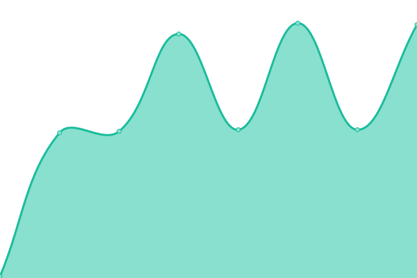

# [📈 Live Status](https://status.premiumfast.net): <!--live status--> **🟧 Partial outage**

This repository contains the open-source uptime monitor and status page for [Premium Fast Network](https://premiumfast.net), powered by [Upptime](https://github.com/upptime/upptime).

With [Upptime](https://upptime.js.org), you can get your own unlimited and free uptime monitor and status page, powered entirely by a GitHub repository. We use [Issues](https://github.com/Premium-Fast-Network/status/issues) as incident reports, [Actions](https://github.com/Premium-Fast-Network/status/actions) as uptime monitors, and [Pages](https://status.premiumfast.net) for the status page.

<!--start: status pages-->
<!-- This summary is generated by Upptime (https://github.com/upptime/upptime) -->
<!-- Do not edit this manually, your changes will be overwritten -->
<!-- prettier-ignore -->
| URL | Status | History | Response Time | Uptime |
| --- | ------ | ------- | ------------- | ------ |
|  [PFN Website](https://premiumfast.net) | 🟩 Up | [pfn-website.yml](https://github.com/Premium-Fast-Network/status/commits/HEAD/history/pfn-website.yml) | 

 133ms
     
 | 

<a href="https://status.premiumfast.net/history/pfn-website">100.00%</a>
    

|  [PFN Billing](https://manage.premiumfast.net) | 🟩 Up | [pfn-billing.yml](https://github.com/Premium-Fast-Network/status/commits/HEAD/history/pfn-billing.yml) | 

 1883ms
     
 | 

<a href="https://status.premiumfast.net/history/pfn-billing">100.00%</a>
    

|  [PFN Documentation](https://docs.premiumfast.net) | 🟩 Up | [pfn-documentation.yml](https://github.com/Premium-Fast-Network/status/commits/HEAD/history/pfn-documentation.yml) | 

 189ms
     
 | 

<a href="https://status.premiumfast.net/history/pfn-documentation">100.00%</a>
    

|  [PFN Panel VPS](https://panel.premiumfast.net:4083) | 🟩 Up | [pfn-panel-vps.yml](https://github.com/Premium-Fast-Network/status/commits/HEAD/history/pfn-panel-vps.yml) | 

 1571ms
     
 | 

<a href="https://status.premiumfast.net/history/pfn-panel-vps">100.00%</a>
    

|  [PFN Panel VPS EU](https://panel-eu.premiumfast.net:4083) | 🟩 Up | [pfn-panel-vps-eu.yml](https://github.com/Premium-Fast-Network/status/commits/HEAD/history/pfn-panel-vps-eu.yml) | 

 1215ms
     
 | 

<a href="https://status.premiumfast.net/history/pfn-panel-vps-eu">100.00%</a>
    

|  KVM VPS SG02-NVMe | 🟩 Up | [kvm-vps-sg-02-nv-me.yml](https://github.com/Premium-Fast-Network/status/commits/HEAD/history/kvm-vps-sg-02-nv-me.yml) | 

 229ms
     
 | 

<a href="https://status.premiumfast.net/history/kvm-vps-sg-02-nv-me">100.00%</a>
    

|  KVM VPS SG03-NVMe | 🟩 Up | [kvm-vps-sg-03-nv-me.yml](https://github.com/Premium-Fast-Network/status/commits/HEAD/history/kvm-vps-sg-03-nv-me.yml) | 

 228ms
     
 | 

<a href="https://status.premiumfast.net/history/kvm-vps-sg-03-nv-me">100.00%</a>
    

|  KVM VPS DE02-NVMe | 🟩 Up | [kvm-vps-de-02-nv-me.yml](https://github.com/Premium-Fast-Network/status/commits/HEAD/history/kvm-vps-de-02-nv-me.yml) | 

 134ms
     
 | 

<a href="https://status.premiumfast.net/history/kvm-vps-de-02-nv-me">100.00%</a>
    

|  KVM VPS DE04-NVMe | 🟩 Up | [kvm-vps-de-04-nv-me.yml](https://github.com/Premium-Fast-Network/status/commits/HEAD/history/kvm-vps-de-04-nv-me.yml) | 

 134ms
     
 | 

<a href="https://status.premiumfast.net/history/kvm-vps-de-04-nv-me">100.00%</a>
    

|  KVM VPS DE05-NVMe | 🟩 Up | [kvm-vps-de-05-nv-me.yml](https://github.com/Premium-Fast-Network/status/commits/HEAD/history/kvm-vps-de-05-nv-me.yml) | 

 133ms
     
 | 

<a href="https://status.premiumfast.net/history/kvm-vps-de-05-nv-me">100.00%</a>
    

|  GRE-DE04 | 🟩 Up | [gre-de-04.yml](https://github.com/Premium-Fast-Network/status/commits/HEAD/history/gre-de-04.yml) | 

 135ms
     
 | 

<a href="https://status.premiumfast.net/history/gre-de-04">100.00%</a>
    

|  GRE-DE05 | 🟩 Up | [gre-de-05.yml](https://github.com/Premium-Fast-Network/status/commits/HEAD/history/gre-de-05.yml) | 

 135ms
     
 | 

<a href="https://status.premiumfast.net/history/gre-de-05">100.00%</a>
    

|  [PFN Seedbox01](https://s01.pfnservers.net) | 🟩 Up | [pfn-seedbox01.yml](https://github.com/Premium-Fast-Network/status/commits/HEAD/history/pfn-seedbox01.yml) | 

 567ms
     
 | 

<a href="https://status.premiumfast.net/history/pfn-seedbox01">100.00%</a>
    

|  [PFN Seedbox02](https://s02.pfnservers.net) | 🟩 Up | [pfn-seedbox02.yml](https://github.com/Premium-Fast-Network/status/commits/HEAD/history/pfn-seedbox02.yml) | 

 712ms
     
 | 

<a href="https://status.premiumfast.net/history/pfn-seedbox02">100.00%</a>
    

|  PFN VPN US | 🟩 Up | [pfn-vpn-us.yml](https://github.com/Premium-Fast-Network/status/commits/HEAD/history/pfn-vpn-us.yml) | 

 184ms
     
 | 

<a href="https://status.premiumfast.net/history/pfn-vpn-us">100.00%</a>
    

|  PFN VPN ID | 🟩 Up | [pfn-vpn-id.yml](https://github.com/Premium-Fast-Network/status/commits/HEAD/history/pfn-vpn-id.yml) | 

 238ms
     
 | 

<a href="https://status.premiumfast.net/history/pfn-vpn-id">100.00%</a>
    

|  PFN VPN SG | 🟩 Up | [pfn-vpn-sg.yml](https://github.com/Premium-Fast-Network/status/commits/HEAD/history/pfn-vpn-sg.yml) | 

 47ms
     
 | 

<a href="https://status.premiumfast.net/history/pfn-vpn-sg">100.00%</a>
    

|  [PFNDrive](https://pfndrive.my.id) | 🟩 Up | [pfn-drive.yml](https://github.com/Premium-Fast-Network/status/commits/HEAD/history/pfn-drive.yml) | 

 1066ms
     
 | 

<a href="https://status.premiumfast.net/history/pfn-drive">100.00%</a>
    

|  [PFNDrive API](https://api.pfndrive.my.id) | 🟩 Up | [pfn-drive-api.yml](https://github.com/Premium-Fast-Network/status/commits/HEAD/history/pfn-drive-api.yml) | 

 1059ms
     
 | 

<a href="https://status.premiumfast.net/history/pfn-drive-api">100.00%</a>
    

|  [PFNDrive Console [DEV]](https://console-dev.pfndrive.my.id) | 🟩 Up | [pfn-drive-console-dev.yml](https://github.com/Premium-Fast-Network/status/commits/HEAD/history/pfn-drive-console-dev.yml) | 

 348ms
     
 | 

<a href="https://status.premiumfast.net/history/pfn-drive-console-dev">100.00%</a>
    

|  [PFNDrive API [DEV]](https://api-dev.pfn.my.id) | 🟩 Up | [pfn-drive-api-dev.yml](https://github.com/Premium-Fast-Network/status/commits/HEAD/history/pfn-drive-api-dev.yml) | 

 1136ms
     
 | 

<a href="https://status.premiumfast.net/history/pfn-drive-api-dev">100.00%</a>
    

|  [KrmPesan Documentation](https://docs.krmpesan.com) | 🟩 Up | [krm-pesan-documentation.yml](https://github.com/Premium-Fast-Network/status/commits/HEAD/history/krm-pesan-documentation.yml) | 

 207ms
     
 | 

<a href="https://status.premiumfast.net/history/krm-pesan-documentation">100.00%</a>
    

|  [KrmPesan REG-01](https://region01.krmpesan.com) | 🟩 Up | [krm-pesan-reg-01.yml](https://github.com/Premium-Fast-Network/status/commits/HEAD/history/krm-pesan-reg-01.yml) | 

 722ms
     
 | 

<a href="https://status.premiumfast.net/history/krm-pesan-reg-01">100.00%</a>
    

|  [KrmPesan REG-02](https://region02.krmpesan.com) | 🟩 Up | [krm-pesan-reg-02.yml](https://github.com/Premium-Fast-Network/status/commits/HEAD/history/krm-pesan-reg-02.yml) | 

 722ms
     
 | 

<a href="https://status.premiumfast.net/history/krm-pesan-reg-02">100.00%</a>
    

|  [KrmPesan Console](https://console.krmpesan.com) | 🟥 Down | [krm-pesan-console.yml](https://github.com/Premium-Fast-Network/status/commits/HEAD/history/krm-pesan-console.yml) | 

 659ms
     
 | 

<a href="https://status.premiumfast.net/history/krm-pesan-console">100.00%</a>
    

|  [KrmPesan API](https://api.krmpesan.com) | 🟩 Up | [krm-pesan-api.yml](https://github.com/Premium-Fast-Network/status/commits/HEAD/history/krm-pesan-api.yml) | 

 637ms
     
 | 

<a href="https://status.premiumfast.net/history/krm-pesan-api">100.00%</a>
    

|  KrmPesan VM-01 | 🟩 Up | [krm-pesan-vm-01.yml](https://github.com/Premium-Fast-Network/status/commits/HEAD/history/krm-pesan-vm-01.yml) | 

 151ms
     
 | 

<a href="https://status.premiumfast.net/history/krm-pesan-vm-01">100.00%</a>
    

|  KrmPesan VM-02 | 🟩 Up | [krm-pesan-vm-02.yml](https://github.com/Premium-Fast-Network/status/commits/HEAD/history/krm-pesan-vm-02.yml) | 

 150ms
     
 | 

<a href="https://status.premiumfast.net/history/krm-pesan-vm-02">100.00%</a>
    

|  KrmPesan VM-03 | 🟩 Up | [krm-pesan-vm-03.yml](https://github.com/Premium-Fast-Network/status/commits/HEAD/history/krm-pesan-vm-03.yml) | 

 151ms
     
 | 

<a href="https://status.premiumfast.net/history/krm-pesan-vm-03">100.00%</a>
    

|  KrmPesan CORE-01 | 🟩 Up | [krm-pesan-core-01.yml](https://github.com/Premium-Fast-Network/status/commits/HEAD/history/krm-pesan-core-01.yml) | 

 140ms
     
 | 

<a href="https://status.premiumfast.net/history/krm-pesan-core-01">100.00%</a>
    

|  KrmPesan CORE-02 | 🟩 Up | [krm-pesan-core-02.yml](https://github.com/Premium-Fast-Network/status/commits/HEAD/history/krm-pesan-core-02.yml) | 

 141ms
     
 | 

<a href="https://status.premiumfast.net/history/krm-pesan-core-02">100.00%</a>
    

<!--end: status pages-->

[**Visit our status website →**](https://status.premiumfast.net)

## 📄 License

- Powered by: [Upptime](https://github.com/upptime/upptime)
- Code: [MIT](./LICENSE) © [Premium Fast Network](https://premiumfast.net)
- Data in the `./history` directory: [Open Database License](https://opendatacommons.org/licenses/odbl/1-0/)
